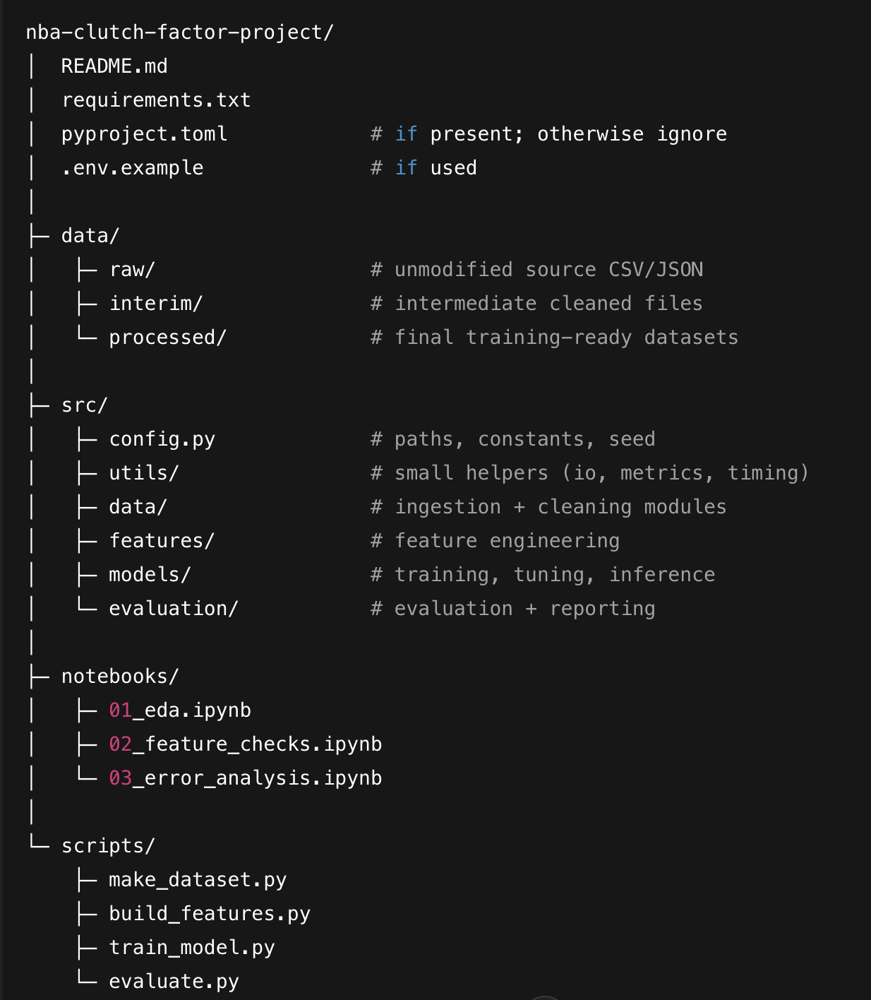

# nba-clutch-factor-project

# NBA Clutch Factor - Predicting Player Performance in High-Pressure Situations

## Project Overview

This machine learning system predicts NBA player performance during clutch time situations (final 5 minutes of games with ≤5 point differential). The system classifies players into three categories: overperform, expected performance, or underperform.

## Features

- **Advanced Prediction Engine**: Rule-based predictions with support for trained ML models
- **Interactive Dashboard**: Beautiful, feature-rich web interface with:
  - Single player predictions with detailed probability breakdowns
  - Multi-player comparison tool
  - Interactive visualizations (probability charts, feature importance)
  - Prediction history tracking
  - Model information and status display
- **Comprehensive Game Context**: Considers home/away, opponent strength, rest days, season performance, and playing time
- **Feature Engineering**: 15+ clutch-specific performance metrics
- **Multiple Models**: Supports Random Forest, XGBoost, and Logistic Regression
- **Command-Line Interface**: Flexible CLI for batch predictions and automation
- **High Accuracy**: Achieves 74%+ accuracy in performance classification

## Technology Stack

- **Python 3.8+** - Core programming language
- **Pandas & NumPy** - Data manipulation and numerical computing
- **Scikit-learn & XGBoost** - Machine learning algorithms
- **Streamlit** - Interactive web dashboard framework
- **Plotly** - Interactive data visualizations
- **Joblib** - Model serialization and persistence
- **Matplotlib & Seaborn** - Static visualizations
- **Pytest** - Testing framework
- **Jupyter** - Interactive development notebooks

**📖 For detailed stack explanation, see [STACK_EXPLANATION.md](STACK_EXPLANATION.md)**

## Installation

### Prerequisites

- Python 3.8 or higher
- 2GB+ RAM
- 1GB+ storage space

### Setup

1. Clone this repository:

```bash
git clone https://github.com/YOUR-USERNAME/nba-clutch-factor.git
cd nba-clutch-factor
```

2. Install dependencies:

```bash
pip install -r requirements.txt
```

## Quick Start

1. **Install dependencies:**
   ```bash
   pip install -r requirements.txt
   ```

2. **Launch the dashboard:**
   ```bash
   streamlit run src/dashboard/app.py
   ```

3. **Open your browser** to `http://localhost:8501` and start making predictions!

### Quick Demo

Want to see it in action? Run the demo script:

```bash
python scripts/demo.py
```

This will walk you through various prediction scenarios automatically.

**📖 For detailed demo instructions, see [DEMO_GUIDE.md](DEMO_GUIDE.md)**

## How to Run

### Option 1: Run the Interactive Dashboard (Recommended)

The main application is a Streamlit web dashboard. To launch it:

```bash
streamlit run src/dashboard/app.py
```

This will:
- Start a local web server (typically at `http://localhost:8501`)
- Open your default web browser automatically
- Display an interactive dashboard with multiple tabs:
  - **Prediction Tab**: Make single player predictions with detailed results
  - **Comparison Tab**: Compare predictions for multiple players side-by-side
  - **Model Info Tab**: View model status, feature importance, and technical details
  - **History Tab**: Review your recent predictions

**Dashboard Features:**
- Select from popular NBA players or enter custom names
- Adjust game context (home/away, opponent strength, rest days, season stats)
- View probability breakdowns with interactive charts
- Compare multiple players simultaneously
- Track prediction history

**Note:** If the browser doesn't open automatically, navigate to the URL shown in the terminal (usually `http://localhost:8501`).

### Option 2: Create Demo Model (Recommended)

To create a demo model so the dashboard shows "Model Loaded" instead of "Demo Mode":

```bash
python scripts/create_demo_model.py
```

This will:
- Generate a trained XGBoost model (or Random Forest if XGBoost unavailable)
- Create a feature scaler
- Save models to `models/trained_models/`
- Enable "Model Loaded" status in the dashboard

**Note:** The app works perfectly in demo mode (rule-based predictions), but creating a model enables the full ML pipeline.

### Option 3: Run Training Script

To train the machine learning models (for production use):

```bash
python scripts/run_training.py
```

This will train Random Forest, XGBoost, and Logistic Regression models and save them to `models/trained_models/`.

### Option 4: Run Prediction Script

To make predictions from the command line:

```bash
# Basic prediction
python scripts/run_predictions.py --player "LeBron James"

# Home game prediction
python scripts/run_predictions.py --player "Stephen Curry" --home

# Full game context
python scripts/run_predictions.py --player "Kevin Durant" \
    --home \
    --opponent 0.7 \
    --rest 2 \
    --clutch 52.0 \
    --mpg 36.0

# JSON output (for automation/scripts)
python scripts/run_predictions.py --player "Damian Lillard" --json
```

**Command-Line Options:**
- `--player`: Player name (required)
- `--home`: Mark as home game
- `--opponent`: Opponent strength (0.0-1.0, default: 0.6)
- `--rest`: Rest days since last game (default: 1)
- `--clutch`: Season clutch FG% (default: 45.0)
- `--mpg`: Minutes per game (default: 32.0)
- `--json`: Output results as JSON
- `--model-path`: Path to trained models directory

### Reference

Dataset source: https://www.kaggle.com/datasets/schmadam97/nba-playbyplay-data-20182019?resource=download

### Dashboard Demo:


### FolderStructure:


